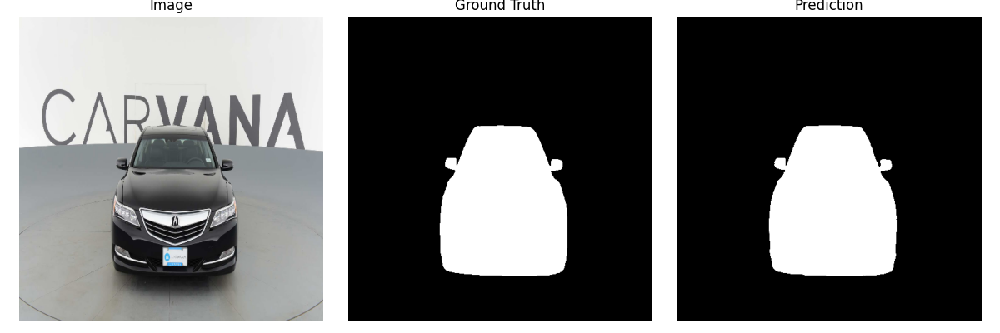

# **Carvana Image Masking Challenge**

This project participates in the **Carvana Image Masking Challenge** hosted on Kaggle. The goal is to segment the car body from vehicle images.

---

## **How to Run**

1. **Install dependencies**

   ```bash
   pip install -r requirements.txt
   ```

2. **Prepare data**

   ```bash
   python utils/split_raw_data.py
   ```

3. **Train the model**

   ```bash
   python script/train.py
   ```

4. **Evaluate the model**

   ```bash
   python script/evaluate.py
   ```

5. **Watch predicted results**



---

## **Dataset**

* **Source**: Kaggle Carvana Image Masking Challenge
* **Format**:

  * **Images**: RGB photos (1918×1280 pixels), each containing a full car.
  * **Labels**: Corresponding binary masks where each pixel is labeled as `1` (car) or `0` (background).
* **Preprocess**:

  * **Train/Test Split**
  * **Resize to (512, 512)**
  * **Normalization**

---

## **Model Architecture**

The project uses the classic **U-Net** architecture:

| Item              | Value     |
| ----------------- | --------- |
| **#Parameters**   | \~ 31M    |
| **Optimizer**     | Adam      |
| **Learning Rate** | 1e-4      |
| **Loss Function** | Dice Loss |
| **Batch Size**    | 4         |
| **Epochs**        | 10        |

---

### **Loss Functions**

* **Dice Loss**:

  * Helps address class imbalance
  * Focuses learning on the object region (e.g., the car) instead of the background

---

## **Optimization**

* **Data Augmentation**: Horizontal flip, random crop, brightness adjustment, scaling
* **Input Size**: Cropped to 1024×512 or similar based on GPU memory
* **Optimizer**: Change Optimizer
* **Learning Rate Schedule**: Cosine Annealing or ReduceLROnPlateau
* **Training Techniques**:

  * Mixed-precision training (AMP) for speed
  * Test Time Augmentation (TTA)
  * Model ensembling for better robustness

---

## **Results**

| Model                   | Mean IoU |
| ----------------------- | -------- |
| Unet (Without Training) | 0.20     |
| Unet (With Training)    | 0.99     |

**Note**: Time: \~25 hours on NVIDIA RTX 4090